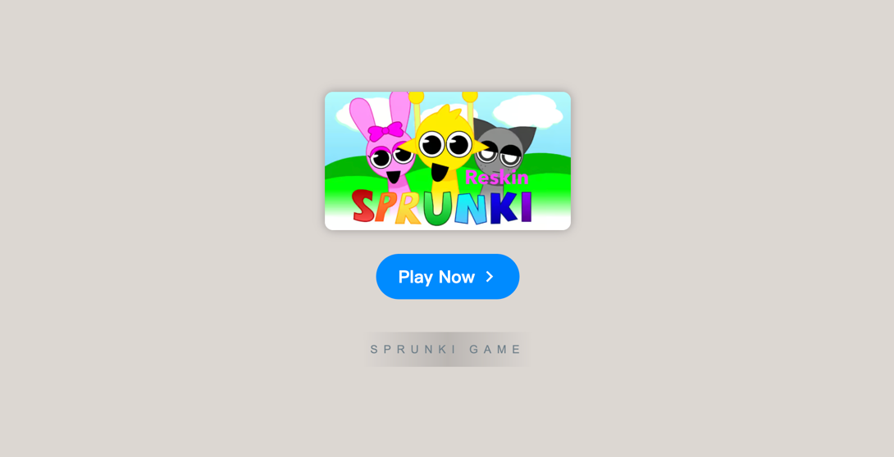

# ParaSprunki 9.0

    

Welcome to **[ParaSprunki 9.0](https://sprunkionline.com/parasprunki)**, the latest version of the thrilling game that takes the Sprunki universe to new heights. With its cutting-edge features and spine-chilling soundscapes, ParaSprunki 9.0 offers an unforgettable experience for fans and newcomers alike. In this guide, we’ll walk you through the key features, game modes, and tips to help you master this intense, horror-themed musical journey.

### Table of Contents
- Introduction
- Features
- Installation
- Gameplay Overview
- ParaSprunki Phases
- Popular Modes & Mods
- Tips for Success
- Resources

### Introduction

**ParaSprunki 9.0** builds upon the foundation laid by its predecessors, adding new characters, unique sounds, and exciting mods. Whether you're a returning player or experiencing ParaSprunki for the first time, you'll find a world full of creativity and eerie thrill. Immerse yourself in the unsettling atmosphere, where each beat carries an element of suspense, making every moment of gameplay unpredictable and exciting.

### Features

| Feature                   | Description                                                                        |
|---------------------------|------------------------------------------------------------------------------------|
| **ParaSprunki Mod**        | Create chilling music with ParaSprunki characters and unsettling sound effects.      |
| **Incredibox Phase 9.0**   | New characters, sounds, and dark themes bring a fresh twist to the gameplay.         |
| **ParaSprunki Nightmare**  | Experience a twisted version of your favorite beats with this horror-themed mod.    |
| **Creepy Characters**      | Explore new characters that add a haunting dimension to your musical creations.      |
| **Online Play**            | No download needed—play and share your music creations directly from your browser.    |
| **Free Access**            | Enjoy all features and mods for free.                                               |
| **Community Sharing**      | Save, share, and gather feedback from the growing ParaSprunki community.             |

### Installation

ParaSprunki 9.0 is fully browser-based, so getting started is simple. Just follow these steps:

1. **Open a Browser**: Make sure you're using a modern browser like Chrome, Firefox, or Safari.
2. **Visit the Website**:
    - [ParaSprunki 9.0](https://sprunkionline.com/parasprunki)
3. **Play**: Hit "Play" and enter the world of ParaSprunki.

### Gameplay Overview

ParaSprunki 9.0 is a rhythm and music creation game that allows players to compose beats using unique characters:

1. **Select Characters**: Drag and drop characters that each represent a sound or music effect to build your track.
2. **Combine Sounds**: Layer different sounds to create complex, eerie music compositions.
3. **Save & Share**: Once you're satisfied with your creation, save it and share it with the ParaSprunki community.

### ParaSprunki Phases

ParaSprunki 9.0 includes a variety of new phases, each adding a new layer of complexity and eerie vibes to the game:

| Phase                 | Description                                                                                       |
|-----------------------|---------------------------------------------------------------------------------------------------|
| **ParaSprunki Phase 9**| A dark new phase featuring unique character designs and sounds that fit the horror theme perfectly.|
| **ParaSprunki Phase 8**| The previous phase that introduces some of the earliest creepy sound effects and visuals.          |
| **Nightmare Mode**     | A terrifying twist on the regular gameplay with more intense music and visual effects.             |
